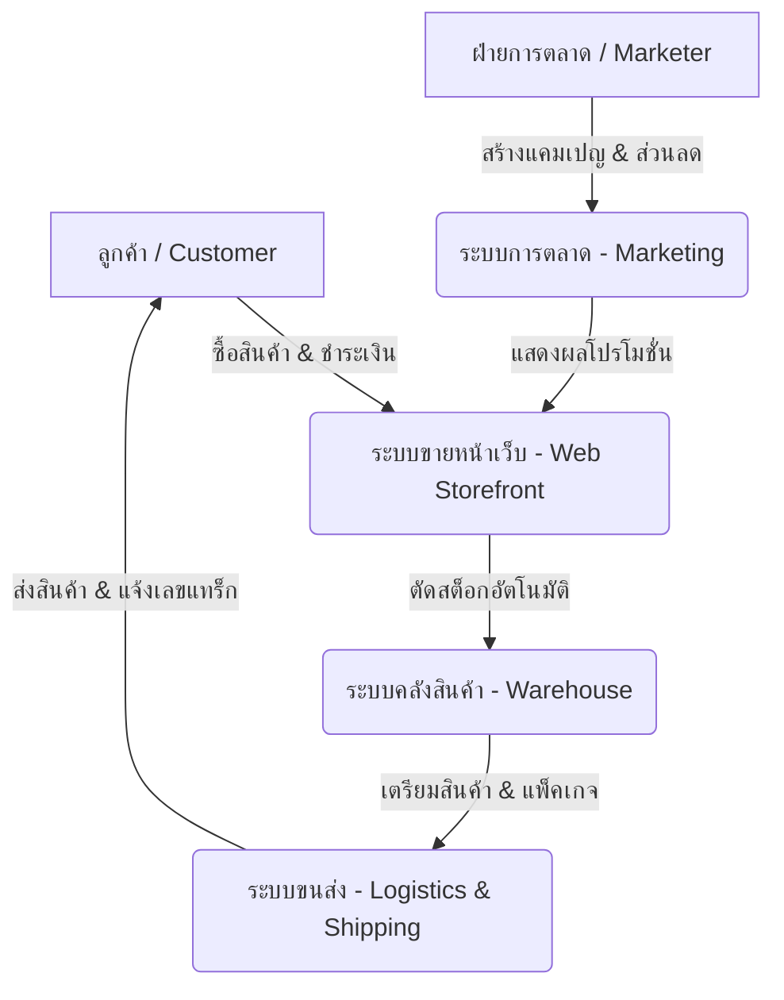

# Software Requirements Specification (SRS)
## แพลตฟอร์ม Suphasan (สุภสาร)

---

### 1. บทนำ (Introduction)

#### 1.1 วัตถุประสงค์ (Purpose)
เอกสารข้อกำหนดความต้องการทางซอฟต์แวร์ (SRS) ฉบับนี้จัดทำขึ้นเพื่อระบุข้อกำหนดการใช้งาน ฟังก์ชันการทำงาน และข้อจำกัดต่างๆ ของแพลตฟอร์ม **Suphasan** ซึ่งเป็นระบบการจัดการธุรกิจค้าปลีกแบบครบวงจร (E-Commerce & ERP Integration) ที่มุ่งเน้นการเชื่อมโยงระบบการขายหน้าเว็บ การจัดการคลังสินค้า การทำตลาด และการจัดส่งสินค้าเข้าด้วยกันอย่างราบรื่น

#### 1.2 ขอบเขตของระบบ (Scope of System)
แพลตฟอร์ม Suphasan ครอบคลุมการทำงาน 4 ระบบย่อยหลัก ดังนี้:
1. **ระบบขายหน้าเว็บ (Web Storefront Subsystem):** ช่องทางการซื้อสินค้าของลูกค้า รองรับการค้นหา เลือกซื้อ และชำระเงิน
2. **ระบบคลังสินค้า (Inventory & Warehouse Subsystem):** ระบบหลังบ้านสำหรับจัดการสต็อกสินค้า การนำเข้า-ส่งออกสินค้า และควบคุมต้นทุนคลังสินค้า
3. **ระบบการตลาด (Marketing Subsystem):** เครื่องมือส่งเสริมการขาย โปรโมชั่น คูปอง ส่วนลด และการวิเคราะห์กลุ่มเป้าหมาย
4. **ระบบขนส่ง (Logistics & Shipping Subsystem):** การประสานงานกับผู้ให้บริการขนส่ง การคำนวณราคาค่าส่ง และการติดตามสถานะพัสดุ

#### 1.3 กลุ่มผู้ใช้งานระบบ (User Personas & Roles)
*   **ลูกค้าทั่วไป (Customer):** ผู้ซื้อสินค้าผ่านหน้าเว็บไซต์
*   **ผู้ดูแลระบบ/เจ้าของร้าน (Admin/Merchant):** ผู้ควบคุมระบบทั้งหมด ตั้งค่าโปรโมชั่น ดูรายงานวิเคราะห์
*   **เจ้าหน้าที่คลังสินค้า (Warehouse Staff):** ผู้ทำหน้าที่จัดเตรียมสินค้า ตรวจสอบสต็อก แพ็คของ และรับสินค้าเข้าคลัง
*   **เจ้าหน้าที่ฝ่ายการตลาด (Marketer):** ผู้สร้างโปรโมชั่น จัดการสิทธิพิเศษวิเคราะห์ข้อมูลการตลาด
*   **เจ้าหน้าที่ฝ่ายจัดส่ง/ผู้ให้บริการขนส่ง (Logistics Manager):** ผู้จัดการรอบรถ ข้อมูลขนส่ง และอัปเดตการจัดส่ง

---

### 2. ภาพรวมของระบบ (System Overview)

---

### 3. ข้อกำหนดเชิงฟังก์ชัน (Functional Requirements)

#### 3.1 ระบบขายหน้าเว็บ (Web Storefront Subsystem)
ระบบที่ให้บริการลูกค้าสำหรับการเข้าชม เลือกซื้อสินค้า และทำธุรกรรมออนไลน์แบบ Responsive Design รองรับการใช้งานผ่านมือถือและเดสก์ท็อป

*   **FR-WS-01: การค้นหาและแสดงหมวดหมู่สินค้า (Product Directory & Search)**
    *   ลูกค้าสามารถค้นหาสินค้าด้วยคีย์เวิร์ด ชื่อสินค้า หรือแท็กที่เกี่ยวข้องได้
    *   ระบบรองรับการกรองสินค้า (Filter) ตามราคา, คะแนนรีวิว, สี, ขนาด และประเภทสินค้า
    *   หน้าจอแสดงสถานะสต็อกแบบเรียลไทม์ (เช่น "มีสินค้า", "สินค้าหมด", "เหลือเพียง 3 ชิ้น")
*   **FR-WS-02: ตะกร้าสินค้าและการสั่งซื้อ (Shopping Cart & Checkout)**
    *   ลูกค้าสามารถเพิ่มสินค้าลงตะกร้า ปรับจำนวน และลบสินค้าได้
    *   ระบบคำนวณยอดรวม ราคาส่วนลด ภาษีมูลค่าเพิ่ม (VAT) และค่าจัดส่งให้อัตโนมัติก่อนชำระเงิน
    *   รองรับ Guest Checkout (ซื้อโดยไม่ต้องสมัครสมาชิก) และ Member Checkout
*   **FR-WS-03: ระบบการชำระเงิน (Payment Gateway Integration)**
    *   รองรับการชำระเงินผ่านบัตรเครดิต/เดบิต, โมบายแบงก์กิ้ง (QR PromptPay), กระเป๋าเงินออนไลน์ (TrueMoney/Rabbit Line Pay) และบริการเก็บเงินปลายทาง (COD)
    *   ระบบต้องได้รับการยืนยันสถานะการจ่ายเงิน (Webhook) จากผู้ให้บริการชำระเงินทันทีเพื่อเปลี่ยนสถานะคำสั่งซื้อเป็น "ชำระเงินแล้ว"
*   **FR-WS-04: บัญชีผู้ใช้และประวัติการสั่งซื้อ (User Account & Order History)**
    *   สมัครและเข้าสู่ระบบด้วย Email, เบอร์โทรศัพท์ หรือ Social Login (Google, Facebook, Line)
    *   สมุดที่อยู่จัดส่งของลูกค้า สามารถบันทึกได้หลายที่อยู่และตั้งค่าที่อยู่เริ่มต้นได้
    *   หน้าตรวจสอบประวัติการซื้อย้อนหลังและปุ่ม "ซื้อซ้ำ" (Reorder)

#### 3.2 ระบบคลังสินค้า (Inventory & Warehouse Subsystem)
ระบบหลังบ้านสำหรับควบคุมปริมาณสินค้า ต้นทุนสินค้า และการจัดเตรียมสินค้าให้เป็นระบบระเบียบ

*   **FR-WH-01: การจัดการข้อมูลสินค้าและสต็อก (Stock Management)**
    *   แอดมินสามารถเพิ่ม แก้ไข ลบ ข้อมูลสินค้า (SKU, ชื่อ, รูปภาพ, ขนาด, น้ำหนัก, ราคาต้นทุน, ราคาขาย)
    *   รองรับการจัดการสินค้าที่มีความหลากหลาย (Multi-Variant Products) เช่น ขนาดเสื้อ สีสินค้า
    *   ระบบอัปเดตยอดคงเหลือของสินค้าอัตโนมัติ (Deduct Stock) ทันทีที่มีการสั่งซื้อจากหน้าเว็บ และคืนสต็อกหากรายการสั่งซื้อถูกยกเลิก
*   **FR-WH-02: การรับเข้าและนำออกสินค้า (Goods Inbound & Outbound)**
    *   บันทึกประวัติการรับสินค้าเข้าคลัง (Purchase Order Receipt) เพื่อคำนวณต้นทุนเฉลี่ยเคลื่อนที่ (Moving Average Cost)
    *   ระบบสร้างใบจัดรายการสินค้า (Pick List) และใบจัดส่งสินค้า (Pack List/Slip) เพื่อให้พนักงานคลังสินค้าหยิบสินค้าได้ถูกต้องตามตำแหน่งชั้นวาง (Location/Bin)
*   **FR-WH-03: ระบบแจ้งเตือนสินค้าใกล้หมด (Low Stock Warning)**
    *   กำหนดเกณฑ์ขั้นต่ำ (Safety Stock/Reorder Point) ของสินค้าแต่ละรายการได้
    *   ระบบส่งการแจ้งเตือน (Email/Dashboard Alert) ไปยังแอดมินเมื่อสินค้าในคลังลดลงถึงระดับที่กำหนดไว้
*   **FR-WH-04: การตรวจสอบสต็อกด้วยระบบบาร์โค้ด (Barcode/QR Code Integration)**
    *   พนักงานสามารถสแกนบาร์โค้ดสินค้าเพื่อทำรับเข้าคลังสินค้า ตรวจสอบตำแหน่ง หรือเช็คสต็อกประจำปี (Physical Stock Count) ผ่านแอปพลิเคชันบนมือถือได้

#### 3.3 ระบบการตลาด (Marketing Subsystem)
ระบบสำหรับดึงดูดลูกค้า กระตุ้นยอดขาย และวิเคราะห์พฤติกรรมของผู้ซื้อสินค้าในแพลตฟอร์ม

*   **FR-MK-01: การจัดแคมเปญโปรโมชั่นและรหัสส่วนลด (Promotions & Coupon Management)**
    *   รองรับการตั้งกฎส่วนลดที่หลากหลาย เช่น ส่วนลดตามเปอร์เซ็นต์ (%), ส่วนลดจำนวนเงินคงที่, โปรโมชั่นซื้อ 1 แถม 1 (Buy 1 Get 1 Free), หรือซื้อครบยอดที่กำหนดส่งฟรี
    *   แอดมินสามารถกำหนดเงื่อนไขคูปองได้ เช่น กำหนดระยะเวลาใช้งาน (Start-End Date), จำกัดจำนวนสิทธิ์ต่อผู้ใช้, และยอดซื้อขั้นต่ำ
*   **FR-MK-02: ระบบสะสมแต้มและสิทธิพิเศษ (Loyalty Program & Reward Points)**
    *   ลูกค้าระดับสมาชิกจะได้รับแต้มสะสมจากยอดการสั่งซื้อสินค้า (เช่น ทุกการจ่ายเงิน 100 บาท รับ 1 แต้ม)
    *   ลูกค้าสามารถใช้แต้มแลกซื้อสินค้า แลกเป็นส่วนลด หรือแลกรับของรางวัลตามที่ระบุไว้ได้
    *   การแบ่งระดับสมาชิก (Tiering System) เช่น Silver, Gold, Platinum ตามยอดซื้อสะสมภายในระยะเวลาที่กำหนดเพื่อรับส่วนลดเพิ่มเติม
*   **FR-MK-03: การทำแคมเปญประชาสัมพันธ์เชิงเป้าหมาย (Targeted Marketing & Notifications)**
    *   การทำ Abandoned Cart Notification: ระบบส่งอีเมลหรือการแจ้งเตือนเตือนลูกค้าที่เพิ่มสินค้าลงตะกร้าแต่ยังไม่ชำระเงินภายในเวลาที่กำหนด (เช่น 2 ชั่วโมง)
    *   การจัดกลุ่มลูกค้า (Customer Segmentation) ตามพฤติกรรมการซื้อ เพื่อส่งโปรโมชั่นเฉพาะกลุ่มผ่าน Email หรือ SMS
*   **FR-MK-04: รายงานและการวิเคราะห์ข้อมูล (Analytics & Marketing Dashboard)**
    *   รายงานยอดขายรายวัน รายสัปดาห์ และรายเดือน
    *   แสดงอันดับสินค้าขายดี (Top Selling Products) และรายงานอัตราการเปลี่ยนเป็นยอดขาย (Conversion Rate) ของแคมเปญต่างๆ

#### 3.4 ระบบขนส่ง (Logistics & Shipping Subsystem)
ระบบบริหารจัดการการนำส่งสินค้าจากคลังสินค้าไปถึงมือผู้รับปลายทางอย่างปลอดภัยและรวดเร็ว

*   **FR-LG-01: เชื่อมต่อผู้ให้บริการจัดส่งและ API ขนส่ง (Logistics APIs Integration)**
    *   เชื่อมต่อ API กับผู้ให้บริการขนส่งชั้นนำ เช่น Thailand Post, Kerry Express, Flash Express, J&T Express เป็นต้น
    *   ดึงข้อมูลสถานะและสร้างใบปะหน้าพัสดุ (Shipping Label) ที่มีบาร์โค้ดและเลขติดตาม (Tracking Number) ได้จากระบบโดยตรง
*   **FR-LG-02: คำนวณค่าจัดส่งอัจฉริยะ (Dynamic Shipping Calculator)**
    *   คำนวณค่าจัดส่งตามน้ำหนักรวม ขนาดของกล่องพัสดุ (Dimensional Weight) และรหัสไปรษณีย์ปลายทาง
    *   รองรับการคิดค่าจัดส่งคงที่ (Flat Rate) หรือยกเว้นค่าจัดส่งตามพื้นที่และเงื่อนไขการตลาด
*   **FR-LG-03: ระบบแจ้งเตือนและติดตามสถานะพัสดุ (Order Tracking System)**
    *   ระบบส่งเลข Tracking Number ให้ลูกค้าผ่านทาง Email และ SMS พร้อมลิงก์สำหรับตรวจสอบสถานะทันทีเมื่อส่งของมอบให้ขนส่งแล้ว
    *   มีหน้าเว็บสำหรับเช็คสถานะการจัดส่ง (Tracking Portal) บนแพลตฟอร์ม Suphasan โดยตรงโดยอัปเดตข้อมูลแบบเรียลไทม์จากระบบขนส่ง
*   **FR-LG-04: ระบบจัดการการคืนสินค้า (Return & Reverse Logistics)**
    *   ลูกค้ายื่นคำร้องขอคืนสินค้าหรือเคลมสินค้าผ่านระบบหน้าเว็บได้
    *   ระบบออกใบส่งคืนสินค้า (Return Label) ให้ลูกค้าพิมพ์และนำไปฝากส่งคืนได้ฟรีหรือตามเงื่อนไขที่กำหนด
    *   พนักงานคลังตรวจสอบของที่ส่งคืนและอัปเดตสต็อกสินค้าเพื่อทำเรื่องคืนเงิน (Refund) ต่อไป

---

### 4. ฟังก์ชันแนะนำเพื่อเพิ่มประสิทธิภาพเชิงธุรกิจและระบบอัจฉริยะ (Business & System Efficiency Enhancements)

เพื่อเพิ่มความสามารถการแข่งขันและยกระดับประสิทธิภาพการทำงานของแพลตฟอร์ม Suphasan ควรมีระบบย่อยเพิ่มเติมหรือความสามารถขั้นสูงในแต่ละส่วนดังนี้:

#### 4.1 ระบบจัดการช่องทางการขายหลายแพลตฟอร์ม (Omnichannel & Marketplace Synchronization)
*   **ซิงค์ข้อมูลสินค้าและสต็อกแบบเรียลไทม์ (Multi-Channel Sync):** เชื่อมต่อกับ Marketplace ชั้นนำ (Shopee, Lazada, TikTok Shop) เมื่อมีการซื้อสินค้าจากแพลตฟอร์มใดสต็อกในระบบคลังของ Suphasan และแพลตฟอร์มอื่นๆ จะถูกตัดพร้อมกันโดยอัตโนมัติ เพื่อป้องกันปัญหาสต็อกขาดหรือสต็อกเกิน (Overselling)
*   **ระบบเชื่อมต่อหน้าร้านกายภาพ (POS - Point of Sale Integration):** หากธุรกิจมีหน้าร้านออฟไลน์ ระบบ POS จะต้องเชื่อมสต็อกและประวัติสมาชิกเป็นฐานข้อมูลเดียวกันกับหน้าเว็บออนไลน์

#### 4.2 ระบบวิเคราะห์ข้อมูลและ AI อัจฉริยะ (AI-Driven Analytics & Personalization)
*   **ระบบแนะนำสินค้าเฉพาะบุคคล (Product Recommendation Engine):** ใช้ Machine Learning ในการวิเคราะห์พฤติกรรมการเข้าชมประวัติการซื้อ และสินค้าในตะกร้าของลูกค้า เพื่อแนะนำสินค้าที่มีแนวโน้มว่าจะซื้อเพิ่ม (Upselling & Cross-selling) บนหน้าเว็บ
*   **ระบบพยากรณ์ความต้องการสินค้าคงคลัง (Inventory Demand Forecasting):** ใช้ข้อมูลสถิติยอดขายในอดีต (Historical Sales Data) ร่วมกับปัจจัยตามฤดูกาล (Seasonal Trends) เพื่อพยากรณ์ความต้องการสินค้าและช่วงเวลาที่ควรสั่งซื้อสินค้าเพิ่ม ป้องกันปัญหาสินค้าค้างคลังมากเกินไป (Overstocking)

#### 4.3 ระบบจัดการคลังสินค้าหลายสาขาอัจฉริยะ (Distributed Multi-Warehouse Routing)
*   **การเลือกคลังส่งสินค้าอัตโนมัติ (Smart Order Routing):** หากมีคลังสินค้ามากกว่า 1 แห่ง ระบบจะช่วยเลือกตัดสต็อกและจัดส่งจากคลังที่อยู่ใกล้ตำแหน่งจัดส่งของลูกค้ามากที่สุดเพื่อลดค่าใช้จ่ายขนส่งและระยะเวลาส่งสินค้า
*   **ระบบสุ่มตรวจสอบคุณภาพ (Quality Control - QC Workflow):** กระบวนการตรวจรับของเข้าและส่งของออกโดยบังคับให้บันทึกภาพ/วิดีโอ เพื่อป้องกันข้อพิพาทของเสียหายระหว่างขนส่ง

#### 4.4 ระบบบริการลูกค้าและรวมแชทจากทุกช่องทาง (Centralized Customer Support & AI Chatbot)
*   **ระบบรวมศูนย์การติดต่อ (Omnichannel Chat Inbox):** รวบรวมแชทจาก Facebook Messenger, Line Official Account, Instagram และหน้าเว็บเข้ามาอยู่ในระบบแผงควบคุมหลังบ้านที่เดียวให้พนักงานตอบได้สะดวก
*   **บอทตอบคำถามและทำรายการเบื้องต้น (Conversational AI Chatbot):** ช่วยตอบข้อซักถามทั่วไป เช่น การขอตรวจเลขพัสดุ (Tracking Number), สอบถามสถานะการเคลม หรือรายละเอียดสินค้า ทำให้ลดเวลาทำงานของแอดมินลงได้กว่า 60%

#### 4.5 ระบบบัญชีและการออกใบกำกับภาษีอิเล็กทรอนิกส์ (Financial & e-Tax Invoice Integration)
*   **การเชื่อมต่อซอฟต์แวร์บัญชี (ERP & Accounting Connector):** ส่งข้อมูลยอดขาย ต้นทุนคลังสินค้า และข้อมูลการรับเงิน เชื่อมโยงกับโปรแกรมบัญชีชั้นนำ (เช่น Xero, Peak, FlowAccount, Express) ได้อัตโนมัติ
*   **การออกใบกำกับภาษีอิเล็กทรอนิกส์ (e-Tax Invoice & e-Receipt):** ระบบสามารถออกใบกำกับภาษีเต็มรูปแบบส่งตรงไปยังอีเมลของลูกค้าและนำส่งกรมสรรพากรอัตโนมัติทันทีที่ลูกค้าชำระเงินสำเร็จ ช่วยลดขั้นตอนการทำงานแบบดั้งเดิม

---

### 5. ข้อกำหนดที่ไม่ใช่เชิงฟังก์ชัน (Non-Functional Requirements)

*   **NFR-SEC-01 (Security):** ข้อมูลส่วนบุคคลของลูกค้าต้องได้รับการปกป้องตาม พ.ร.บ. คุ้มครองข้อมูลส่วนบุคคล (PDPA) และข้อมูลบัตรเครดิตต้องผ่านการเข้ารหัสตามมาตรฐาน PCI-DSS
*   **NFR-PER-01 (Performance):** หน้าเว็บไซต์ฝั่งลูกค้าต้องโหลดเสร็จสิ้นภายใน 2.5 วินาทีที่ความเร็วอินเทอร์เน็ตปกติ เพื่อป้องกันไม่ให้เกิดความล่าช้าในการเข้าชมสินค้า
*   **NFR-SCA-01 (Scalability):** สถาปัตยกรรมระบบต้องออกแบบให้รองรับการขยายตัวแบบ Auto-scaling เพื่อรองรับผู้ใช้งานพร้อมกันจำนวนมากในเทศกาลลดราคา เช่น แคมเปญ 11.11 หรือ 12.12
*   **NFR-AVA-01 (Availability):** ระบบต้องมีความพร้อมใช้งาน (Uptime) ไม่ต่ำกว่า 99.9% ตลอด 24 ชั่วโมง และมีระบบสำรองข้อมูล (Database Backup) อัตโนมัติทุกวัน
*   **NFR-USA-01 (Usability):** หน้าจอผู้ใช้ฝั่งลูกค้าต้องถูกออกแบบตามหลัก User Experience (UX) ที่ใช้งานง่าย ไม่สับสน รองรับการเปลี่ยนธีม Dark Mode / Light Mode และรองรับสองภาษา (ไทย/อังกฤษ)

